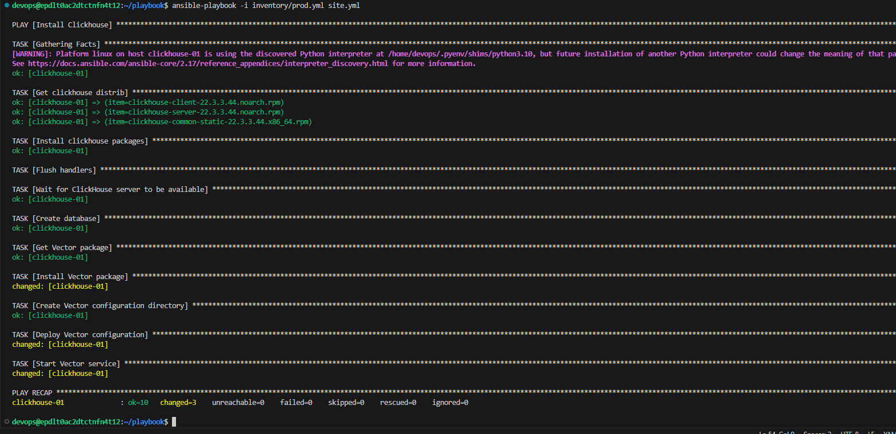
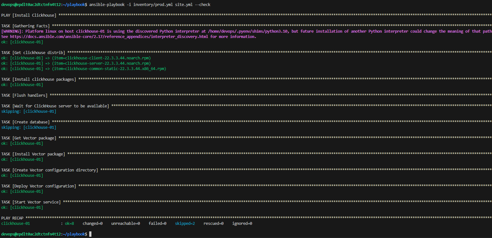
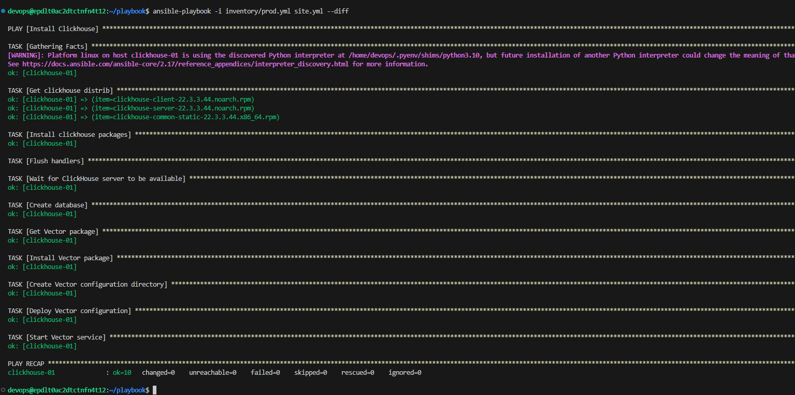
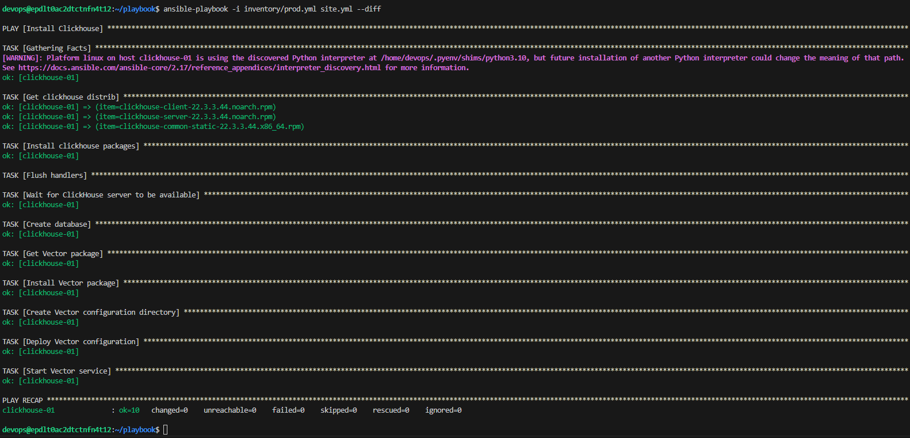

# Домашнее задание к занятию 2 «Работа с Playbook» - Филатов А. В.

## Подготовка к выполнению

1. * Необязательно. Изучите, что такое [ClickHouse](https://www.youtube.com/watch?v=fjTNS2zkeBs) и [Vector](https://www.youtube.com/watch?v=CgEhyffisLY).
2. Создайте свой публичный репозиторий на GitHub с произвольным именем или используйте старый.
3. Скачайте [Playbook](./playbook/) из репозитория с домашним заданием и перенесите его в свой репозиторий.
4. Подготовьте хосты в соответствии с группами из предподготовленного playbook.

## Основная часть

1. Подготовьте свой inventory-файл `prod.yml`.
2. Допишите playbook: нужно сделать ещё один play, который устанавливает и настраивает [vector](https://vector.dev). Конфигурация vector должна деплоиться через template файл jinja2. От вас не требуется использовать все возможности шаблонизатора, просто вставьте стандартный конфиг в template файл. Информация по шаблонам по [ссылке](https://www.dmosk.ru/instruktions.php?object=ansible-nginx-install). не забудьте сделать handler на перезапуск vector в случае изменения конфигурации!
3. При создании tasks рекомендую использовать модули: `get_url`, `template`, `unarchive`, `file`.
4. Tasks должны: скачать дистрибутив нужной версии, выполнить распаковку в выбранную директорию, установить vector.
5. Запустите `ansible-lint site.yml` и исправьте ошибки, если они есть.
6. Попробуйте запустить playbook на этом окружении с флагом `--check`.
7. Запустите playbook на `prod.yml` окружении с флагом `--diff`. Убедитесь, что изменения на системе произведены.
8. Повторно запустите playbook с флагом `--diff` и убедитесь, что playbook идемпотентен.
9. Подготовьте README.md-файл по своему playbook. В нём должно быть описано: что делает playbook, какие у него есть параметры и теги. Пример качественной документации ansible playbook по [ссылке](https://github.com/opensearch-project/ansible-playbook). Так же приложите скриншоты выполнения заданий №5-8
10. Готовый playbook выложите в свой репозиторий, поставьте тег `08-ansible-02-playbook` на фиксирующий коммит, в ответ предоставьте ссылку на него.

---

### Как оформить решение задания

Выполненное домашнее задание пришлите в виде ссылки на .md-файл в вашем репозитории.

---

## Решение

* site.yml  
```
---
- name: Install Clickhouse
  hosts: clickhouse
  handlers:
    - name: Start clickhouse service
      become: true
      ansible.builtin.service:
        name: clickhouse-server
        state: restarted

  tasks:
    - name: Get clickhouse distrib
      ansible.builtin.get_url:
        url: "https://packages.clickhouse.com/rpm/stable/{{ item }}"
        dest: "/tmp/{{ item }}"
      loop: "{{ clickhouse_packages }}"

    - name: Install clickhouse packages
      become: true
      ansible.builtin.yum:
        name:
          - "/tmp/clickhouse-client-{{ clickhouse_version }}.noarch.rpm"
          - "/tmp/clickhouse-server-{{ clickhouse_version }}.noarch.rpm"
          - "/tmp/clickhouse-common-static-{{ clickhouse_version }}.x86_64.rpm"
        validate_certs: no
        disable_gpg_check: yes
      notify: Start clickhouse service

    - name: Flush handlers
      meta: flush_handlers

    - name: Wait for ClickHouse server to be available
      ansible.builtin.wait_for:
        port: 9000
        delay: 10
        timeout: 300

    - name: Create database
      ansible.builtin.command: "clickhouse-client -q 'create database logs;'"
      register: create_db
      failed_when: create_db.rc != 0 and create_db.rc != 82
      changed_when: create_db.rc == 0

    - name: Get Vector package
      become: true
      ansible.builtin.get_url:
        url: "https://yum.vector.dev/stable/vector-0/{{ vector_arch }}/vector-{{ vector_version }}-1.{{ vector_arch }}.rpm"
        dest: "/tmp/vector-{{ vector_version }}-1.{{ vector_arch }}.rpm"

    - name: Install Vector package
      become: true
      ansible.builtin.yum:
        name: "/tmp/vector-{{ vector_version }}-1.{{ vector_arch }}.rpm"
        validate_certs: no
        disable_gpg_check: yes

    - name: Create Vector configuration directory
      become: true
      ansible.builtin.file:
        path: /etc/vector
        state: directory
        mode: '0755'

    - name: Deploy Vector configuration
      become: true
      ansible.builtin.template:
        src: templates/vector.toml.j2
        dest: /etc/vector/vector.toml
        mode: '0644'

    - name: Start Vector service
      become: true
      ansible.builtin.service:
        name: vector
        state: started
        enabled: true

```
Добавил тайм-аут после перезагрузки ClickHouse server, так же убрал ошибки по ssl и gpg

1. 

2. 

3. 

4. 
